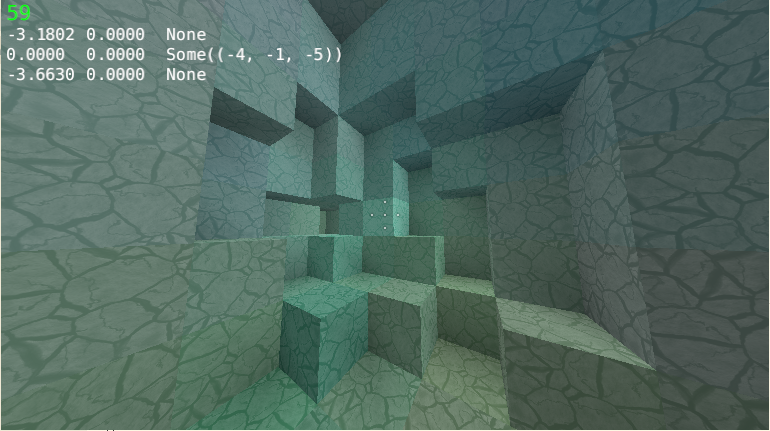

# Carvel [![build-status][tcisvg]][tci] 

[tcisvg]: https://travis-ci.org/dNihil/carvel.svg?branch=master
[tci]: https://travis-ci.org/dNihil/carvel

Infinite mining game built using [Piston](https://www.piston.rs/)

#### Features:
* Infinite world divided into 16^3 regions of blocks
* Realtime voxel meshes with no lag
* Custom player physics and collision